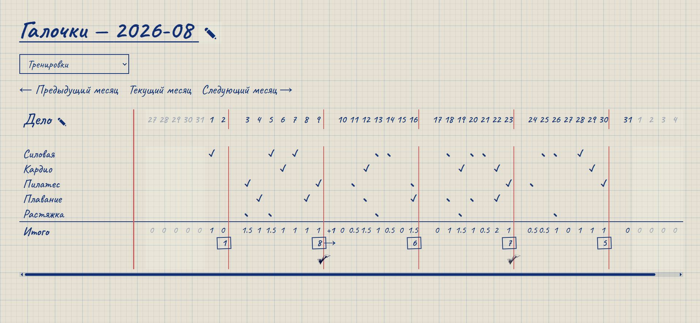
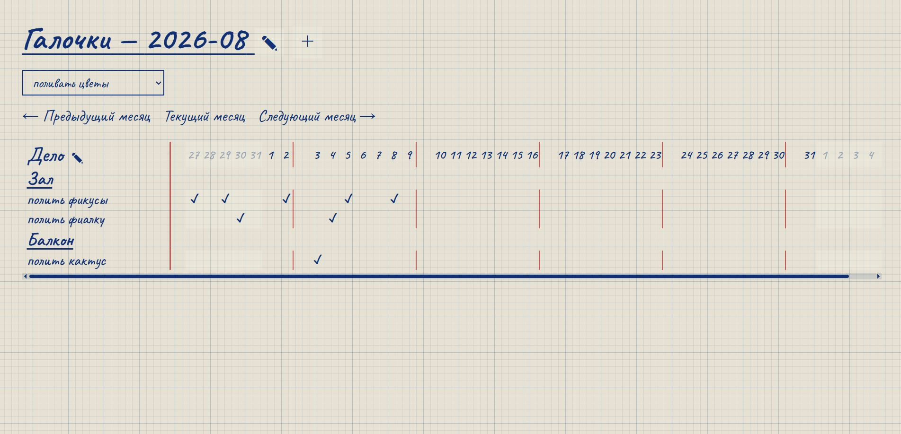
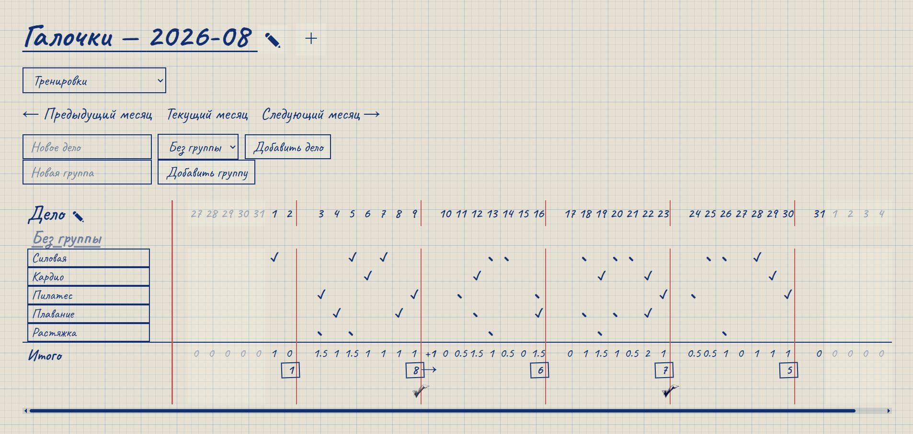
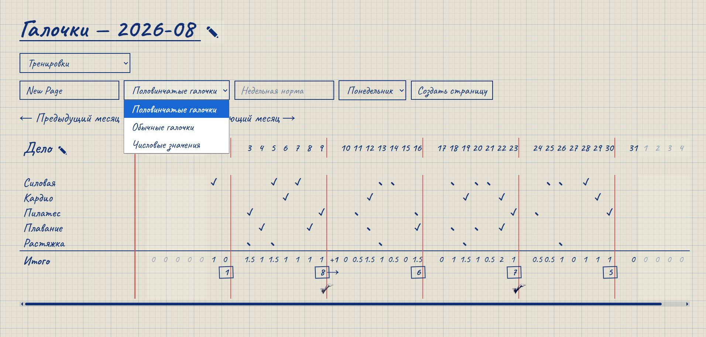
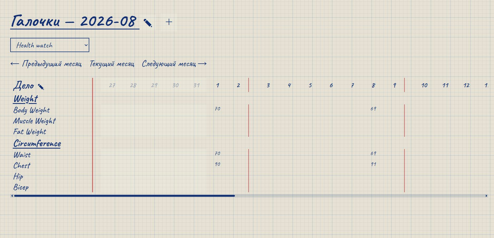

# Galochki

Galochki is a personal activity tracker built with Spring Boot. It is designed around a simple calendar view where users can track daily activities, set weekly goals and monitor progress across different types of pages.

The project focuses on flexible tracking, lightweight interaction and a handwritten notebook-inspired interface.

---

## 🛠️ Tech Stack

* Java 17
* Spring Boot
* Spring MVC
* Spring Data JPA
* Thymeleaf
* Hibernate
* H2 Database
* JavaScript
* HTML
* CSS
* Maven
* JUnit 5
* Mockito

---

## 🚀 Features

* Create multiple activity tracking pages
* Monthly calendar view
* Daily activity tracking
* Activity groups
* Drag & drop activity ordering
* Drag & drop groups
* Weekly goals
* Automatic weekly progress calculation
* Carry-over of progress between weeks
* Binary, half-step and numeric tracking modes
* Inline editing without full page reload
* AJAX updates for activity values and statistics
* Custom handwritten visual style
* Persistent weekly completion marks
* Unit and integration tests



---

## 💡 Main Functionality

### 📅 Monthly Tracker

Each page displays activities in a monthly calendar.

Users can:

* Track values for every day
* Navigate between months
* Organize activities into groups
* Reorder activities and groups
* Edit activity names directly from the page

Updates are performed dynamically without reloading the calendar.

### ✓ Tracking Modes

Pages can use different tracking modes.

**Binary**

Simple completion tracking:

`0 / 1

**Half Step**

Useful when an activity can be completed partially or multiple times:

`0 → 0.5 → 1 → 1.5 → ...`

**Number**

Manual numeric input for values such as:

* Distance
* Time
* Weight
* Money
* Other measurable data

Negative values are also supported.

### 🎯 Weekly Goals

Binary and half-step pages can have a weekly target.

The application automatically calculates:

* Daily totals
* Weekly totals
* Goal completion
* Progress carried over from the previous week

If a user exceeds the weekly goal, the remaining value can be transferred to the following week.

Completed weeks receive a large handwritten checkmark.

### ⚡ Dynamic UI

Daily values and weekly statistics are updated using REST endpoints and JavaScript.

The interface updates:

* Activity cells
* Daily totals
* Weekly totals
* Carry-over values
* Weekly completion status

without refreshing the whole page.

This keeps the current scroll position and avoids visual flickering while tracking activities.

---

## ⚙️ Backend Highlights

The backend uses a layered Spring architecture with:

* MVC controllers
* REST endpoints
* Service layer
* Spring Data repositories
* JPA entities
* DTO-based calendar rendering

Core domain entities include:

* `GalochkiPage`
* `Activity`
* `ActivityGroup`
* `Galochka`
* `PageWeekOverhead`

Weekly goal calculations and carry-over logic are handled on the backend so the UI always receives the recalculated state after an update.

---

## 🎨 Interface

The interface is inspired by a handwritten paper planner.

Visual elements include:

* Notebook grid background
* Handwritten Caveat font
* Ink-style blue controls
* Red weekly separators
* Hand-drawn checkmarks
* Custom horizontal scrollbar

---

## 📸 Screenshots

### Page Without Weekly Goal



### Activity and Groups Editor



### Page Creation



### Numeric Tracking



---

## 📦 Installation

Clone the repository:

```bash
git clone https://github.com/egor-no/galochki-app.git
cd galochki-app
```

Run the application:

```bash
mvn spring-boot:run
```

Open the application in your browser.

The project currently uses a local H2 database.

---

## 🔜 Planned Features

* Activity archiving and deactivation
* Optional percentage progress display
* Extended page settings
* More statistics and progress visualization
* Additional handwritten UI elements
